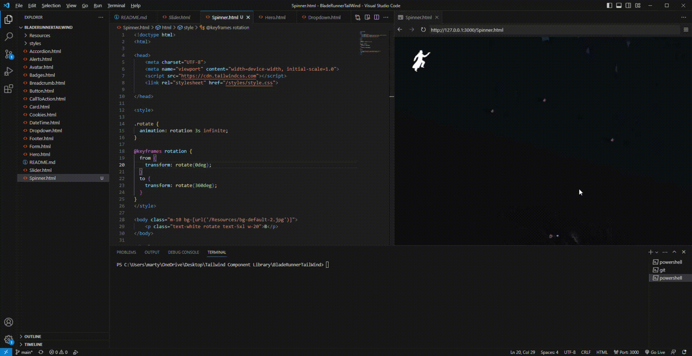
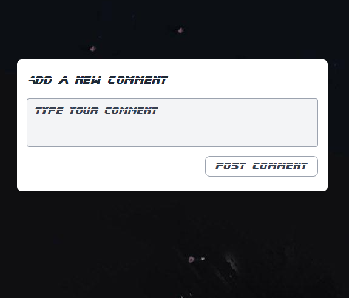
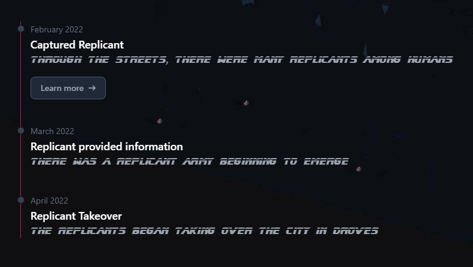

# Blade Runner Themed Tailwind Components! 

## Table of Contents

*   [Accordion](https://github.com/martyjacobsdev/Blade-Runner-Tailwind/blob/main/Accordion.html)

*   [Alert/Notification](https://github.com/martyjacobsdev/Blade-Runner-Tailwind/blob/main/Alerts.html)

*   [Avatar](https://github.com/martyjacobsdev/Blade-Runner-Tailwind/blob/main/Avatar.html)

*   [Badge](https://github.com/martyjacobsdev/Blade-Runner-Tailwind/blob/main/Badges.html)

  
*   [Button](https://github.com/martyjacobsdev/Blade-Runner-Tailwind/blob/main/Button.html)

*   [Breadcrumb](https://github.com/martyjacobsdev/Blade-Runner-Tailwind/blob/main/Breadcrumb.html)

*   [Call to Action](https://github.com/martyjacobsdev/Blade-Runner-Tailwind/blob/main/CallToAction.html)

*   [Slider/Carousel](https://github.com/martyjacobsdev/Blade-Runner-Tailwind/blob/main/Slider.html)

*   [Cookies](https://github.com/martyjacobsdev/Blade-Runner-Tailwind/blob/main/Cookies.html)

*   [Date/Time](https://github.com/martyjacobsdev/Blade-Runner-Tailwind/blob/main/DateTime.html)

*   [Dropdown](https://github.com/martyjacobsdev/Blade-Runner-Tailwind/blob/main/Dropdown.html)

*   [Card](https://github.com/martyjacobsdev/Blade-Runner-Tailwind/blob/main/Card.html)

*   [Form](https://github.com/martyjacobsdev/Blade-Runner-Tailwind/blob/main/Form.html)

*   [Footer](https://github.com/martyjacobsdev/Blade-Runner-Tailwind/blob/main/Footer.html)

*   [Hero](https://github.com/martyjacobsdev/Blade-Runner-Tailwind/blob/main/Hero.html)

*   [Loading/Spinner](https://github.com/martyjacobsdev/Blade-Runner-Tailwind/blob/main/Spinner.html)

  

*   [Modal](https://github.com/martyjacobsdev/Blade-Runner-Tailwind/blob/main/Modal.html)

  

*   [Navigation/Header](https://github.com/martyjacobsdev/Blade-Runner-Tailwind/blob/main/Navigation.html)

  

*   [Pagination](https://github.com/martyjacobsdev/Blade-Runner-Tailwind/blob/main/Pagination.html)
  
    

*   [Sidebar](https://github.com/martyjacobsdev/Blade-Runner-Tailwind/blob/main/Sidebar.html)

    

*   [Progress Bar](https://github.com/martyjacobsdev/Blade-Runner-Tailwind/blob/main/ProgressBar.html)

    

*   [Comment](https://github.com/martyjacobsdev/Blade-Runner-Tailwind/blob/main/Comment.html)

    

*   [Step](https://github.com/martyjacobsdev/Blade-Runner-Tailwind/blob/main/Steps.html)

    

*   [Switch](https://github.com/martyjacobsdev/Blade-Runner-Tailwind/blob/main/Switch.html)

    

*   [Tags](https://github.com/martyjacobsdev/Blade-Runner-Tailwind/blob/main/Tags.html)

    

*   [Tooltips](https://github.com/martyjacobsdev/Blade-Runner-Tailwind/blob/main/Tooltip.html)

    

*   [Table](https://github.com/martyjacobsdev/Blade-Runner-Tailwind/blob/main/Table.html)

    

*   [Tab](https://github.com/martyjacobsdev/Blade-Runner-Tailwind/blob/main/Tab.html)

    

*   [Timeline](https://github.com/martyjacobsdev/Blade-Runner-Tailwind/blob/main/Timeline.html)

    
