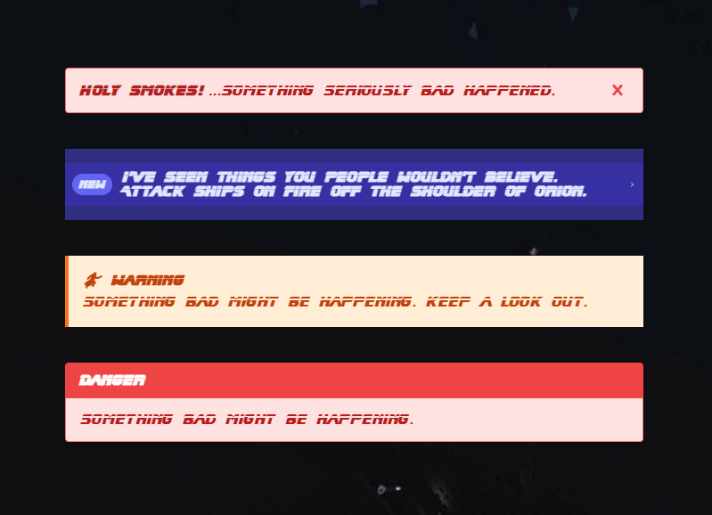

# Blade Runner Themed Tailwind Components! 

## Table of Contents

*   [Accordion](https://github.com/martyjacobsdev/Blade-Runner-Tailwind/blob/main/Accordion.html)

*   [Alert/Notification](https://github.com/martyjacobsdev/Blade-Runner-Tailwind/blob/main/Alerts.html)

*   [Avatar](https://github.com/martyjacobsdev/Blade-Runner-Tailwind/blob/main/Avatar.html)

*   [Badge](https://github.com/martyjacobsdev/Blade-Runner-Tailwind/blob/main/Badges.html)

  
*   [Button](https://github.com/martyjacobsdev/Blade-Runner-Tailwind/blob/main/Button.html)

*   [Breadcrumb](https://github.com/martyjacobsdev/Blade-Runner-Tailwind/blob/main/Breadcrumb.html)

*   [Call to Action](https://github.com/martyjacobsdev/Blade-Runner-Tailwind/blob/main/CallToAction.html)

*   [Slider/Carousel](https://github.com/martyjacobsdev/Blade-Runner-Tailwind/blob/main/Slider.html)

*   [Cookies](#cookies)

*   [Date/Time](#datetime)

*   [Dropdown](#dropdown)

*   [Card](#card)

*   [Form](#form)

*   [Footer](#footer)

*   [Hero](#hero)

*   [Loading/Spinner](#loadingspinner)

*   [Modal](#modal)

*   [Navigation/Header](#navigationheader)

*   [Pagination](#pagination)
  
*   [Sidebar](#sidebar)

*   [Progress Bar](#progress-bar)

*   [Skeleton](#skeleton)

*   [Comment](#comment)

*   [Step](#step)

*   [Switch](#switch)

*   [Tags](#tags)

*   [Tooltips](#tooltips)

*   [Table](#table)

*   [List](#list)

*   [Tab](#tab)

*   [Timeline](#timeline)
